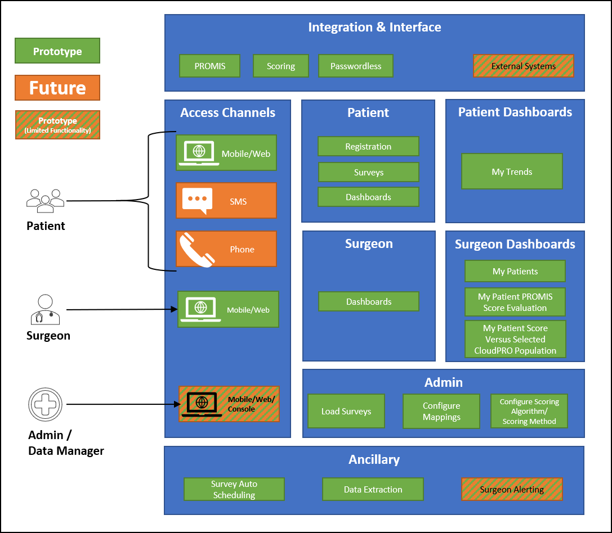

**Breadcrumb**

[Home](../home.md) > Prototyping Background > [Functional Diagram](functional_diagram.md)

# Functional Diagram
The following diagram helps highlight business functionality that the prototype is anticipated to cover.

## Access Channels

The prototype will be limited to only mobile/web access. The prototype will be responsive, so it will fit multiple form factors including desktop, mobile device, and tablet.

## Users

**Patients** are users who are going through a recovery journey associated with a surgery.

**Surgeons** are users that have a collection of patients and are interested in increasing the patient experience through monitoring of their recovery journey.

**Admin/Data Manager** will not be in part of the scope of this prototype; however, certain activities such as loading of PRO Packs will be simulated through manual processes in lieu of a proper user.

## Patient Experience

**Patients** will interact with the prototype through completing a set of auto-assigned surveys (originating from the PROMIS question bank). Patients will be able to track their historical progress of completed surveys through a personalized dashboard.

## Surgeon Experience

**Surgeons** will interact with the prototype through being able to view their assigned patients progress during their recovery. Additionally, they can view dashboards which will provide insights into the overall recovery baseline of their speciality.

## "Administrative" Functionality
As noted, administration functionality is outside of the scope of this prototype; that said, there will be avenues to manually perform some of the anticipated activities of administrative users. These activities are primarily geared towards the development and loading of PROPacks.

## Ancillary
This prototype covers three key ancillary features:
* **Load Surveys**: Ability to load a PROPack into the system
* **Data Extraction**: Ability to extract data from the CloudPRO system to a flat file
* **Surgeon Alerting**: Ability to send notifications to specific users

## Integration & Interface
* This prototype will focus only on a limitted set of PROMIS formatted questions. It will allow for scoring configurations against these surveys.

* This prototype will provide passwordless authentication flows.

* Integration with external systems will be limited to the flat file extraction. This prototype will not include formatting of the extracted file.