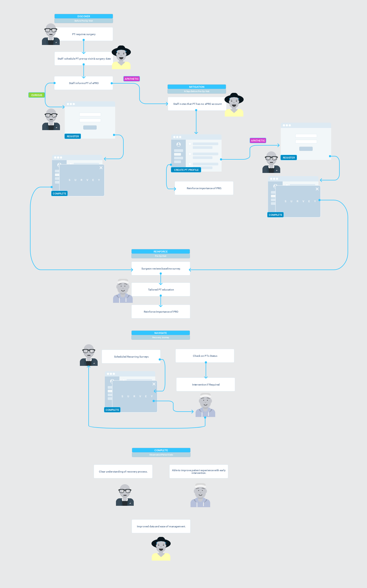

**Breadcrumb**

[Home](../home.md) > Prototyping Background > [High Level Journeys](high_level_journeys.md)

# High Level Journeys
The following describes the general anticipated journey of both surgeon's and patients.

**Surgeon**
1. Request staff to push PRO collection to patient 2 weeks prior to a new patient visit
2. Review pre-op PRO data submitted by patient if available
3. Perform patient education based on baseline responses to set appropriate recovery
expectations
4. Reinforce to patient importance of consistently sharing PROs through recovery
5. During post-operative visit (typically 10 days post-discharge), revisit recovery expectations
based on PROs collected prior to discharge and post-op visit.
6. Continue to reinforce importance of PRO collection
7. Monitor patient progress by reviewing monthly PRO data collections

**Patient**
1. Informed by clinic staff of need to complete first PRO survey prior to pre-operative visit
2. Receives CloudPRO enrollment link along with training on how to complete surveys
3. Enrolls & completes initial pre-op survey
4. Confirms understanding on importance of PRO collection during pre-operative visit
5. Reviews trendline of PRO reporting over time & continues to complete surveys, through the
end of their surveillance period

**The journeys above are further elaborated in the following flow diagram:**

