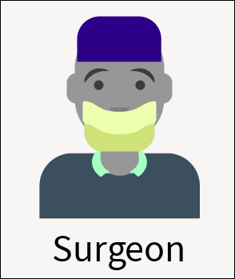

**Breadcrumb**

[Home](../home.md) > Prototyping Background > [Personas in Scope](personas_in_scope.md)

# Personas in Scope
**The prototype being developed will focus on two personas, surgeons & patients.**

|Persona|Description|
|-------------------------|----------------|
||Dr. Hayden is a highly experienced surgeon with over 20 years of experience in their field. They are a board-certified surgeon who specializes in thoracic procedures, and has performed hundreds of successful surgeries over the course of their career. Dr. Hayden is a dedicated physician who is passionate about improving patient outcomes and staying up-to-date with the latest medical advancements.  As a busy surgeon, Dr. Hayden values efficiency and organization. They recognize the importance of tracking patient recovery and closely monitoring post-operative outcomes, but finds it challenging to keep up with this information using PRO processes. Dr. Hayden is excited to utilize the CloudPRO platform to help them track patient recovery in real-time and improve communication with their patients. They value the convenience of being able to access patient data remotely and hopes to utilize the platform to streamline their workflow and improve patient outcomes.
|| Sam Jones is a patient who recently underwent surgery under the care of Dr. Hayden. They are a 66-year-old retiree who values their health and is committed to a speedy recovery. Sam understands the importance of tracking their recovery journey and staying in close communication with their doctor to ensure the best possible outcome. They are excited to utilize CloudPRO to answer surveys and track their recovery progress in real-time.  Sam values convenience and ease-of-use. They appreciate the user-friendly interface of CloudPRO and finds it easy to navigate. Sam is also comforted by the fact that they are able to switch the platform's language to their first language, Spanish. Sam recognizes the importance of staying on top of their recovery and feels confident that utilizing the platform will help them achieve their goals.
