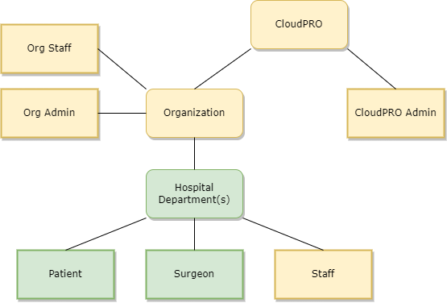
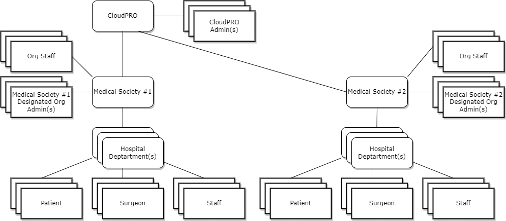

**Breadcrumb**

[Home](../home.md) > Pathway to Production > [Admin Functionality](admin.md)

# Admin Functionality

A key gap that the current prototype does not cover is admin functionality. Many features such as account creation for surgeons, hopsital assignment, survey assignment, etc. are not part of the scope of the prototype.

Versatile admin functionality which respects RBAC philosophies should be developed. A basic proposed structure of the general hierarchy of CloudPRO is shown below.

**Example of two medical societies utilizing CloudPRO**

It will be important to define the roles and responsibilities at each level. Some initial considerations are presented below:

|Element                   |Description                      |Capabilities
|:-------------------------|:--------------------------------|:---------------------------
|CloudPRO                  | The software system             | • Provides functionality of the PRO platform.
|Organization              | A representation of an entity that has one or many hospital departments. An example of this could be a medical society. | • Provides a "bucket" for roll-up statistical functionality.
|Org Staff                 | Staff that work at the org level.| • Analytics & reporting.
|Org Admin                 | Staff that have elevated priviledges for organizations.| • Can create and delete hospital elements. • Create staff for hospitals. • Create surgeons for hospitals.
|Hospital Departments      | Hospitals may have one or many departments that utilize the CloudPRO platform, each with their own individual staff and patients.| • Patients sign up to a hospital department & surgeon
| Patient                  | Demonstrated in prototype. | • Ability to take PRO studies.
| Surgeon                  | Demonstrated in prototype. | • Ability to monitor patient recovery.
| Staff                    | Staff support day to day operations -- whether that is assisting users to pre-register, or correcting data mistakes on the platform for their assigned hospital department. | • Pre-Register patients • Correct data issues • Run reports. • Extract data • Configure PRO pack assignments to patients

**TODO**

* survey assignment template
* staff flow
* export concepts